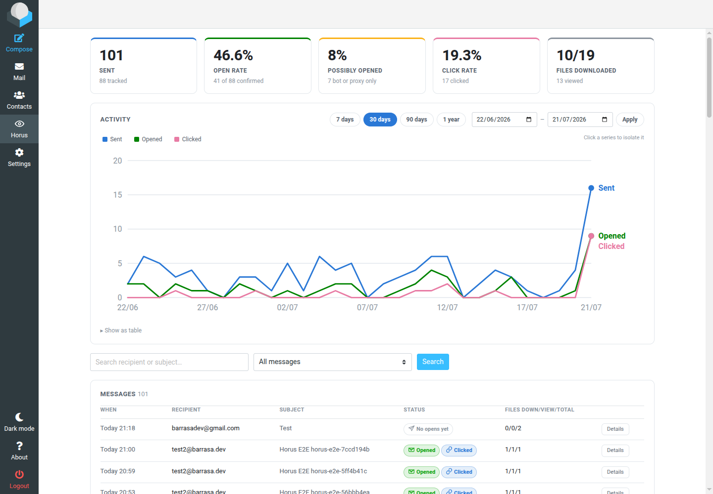

# Horus Plugin

End-to-end email tracking for [Roundcube](https://roundcube.net), self-hosted and
self-contained.

## What is it?

Horus Plugin is a Roundcube plugin that tells you what happened to the mail you sent:
whether it was opened, when, from which client and network, whether the links in it
were followed, and whether the files you sent along were downloaded.

It does that entirely inside your own webmail. Roundcube itself serves the tracking
pixel, the click redirects and the tracked attachments — there is no external service,
no third-party account and no API key. Nothing about your messages or your recipients
leaves your server. Installation is a directory copy and one line of config; the
plugin creates and migrates its own database tables on first login.

What sets it apart from the usual tracking plugin is that it refuses to lie to you.
A pixel fetch is not proof that a human read your email — mail gateways, scanners and
privacy proxies fetch images too. So every open is classified as **confirmed**,
**possibly opened** (a bot or privacy proxy), or **unknown**, and the reasoning behind
each verdict is visible in the UI. Your own views of your own Sent copy are detected
and excluded. "Confirmed" and "possibly opened" are never summed into one flattering
number.



---

## Features

**Sending**
- One UUID per outgoing message, a 1×1 pixel, and every `<a href>` rewritten to a
  signed redirect.
- A tracked message is **always sent as HTML** - a plain-text compose is promoted
  automatically, with the original text kept as the plain alternative.
- **Nothing in the delivered message reveals tracking.** The attachment block uses
  neutral wording and the endpoint URLs carry a neutral parameter name, never
  `horus`. Asserted by test against the real delivered MIME.
- **Tracked attachments** — a second attachment zone in the compose screen. Those
  files are *not* attached to the message: they are stored server-side and the body
  gets a link block instead — filename plus a download button — so each file is
  tracked individually. One click downloads it: the link returns the bytes, never a
  landing page.
- A per-message "Enable tracking" toggle, defaulting to your preference.

**Receiving**
- Three public endpoints served by Roundcube before authentication:
  `/?_horus=px`, `/?_horus=click`, `/?_horus=doc`.
- Every parameter is HMAC-signed, so the redirect cannot be repointed and a document
  link cannot be edited into "download something else".

**Intelligence**
- Each event records the address, its **reverse DNS name resolved at write time**,
  the parsed client/OS/device, the language, the referrer, the proxy chain and the
  raw headers - each rendered with its own icon, and the language with its flag.
- Optional **geolocation** (city, region, country, network operator). It is the one
  feature that contacts a third party, so it is **off by default**, never runs on the
  tracking endpoints, caches per address, and never sends private ranges anywhere.
- A **clients and addresses** roll-up under each timeline: who was involved in total,
  rather than what happened in order.
- The PTR name also feeds the classifier — a host under `proofpoint.com` is a gateway
  whatever its user agent claims.

**Reporting**
- A **Horus** entry in the sidebar with a dashboard: headline metrics, an activity
  chart, recipient search, filters and a per-message event timeline.
- The chart covers **7 / 30 / 90 days, a year, or any custom range**. Buckets adapt
  to the span — daily up to a quarter, then weekly, then monthly — so a long window
  stays readable. Metrics and tiles follow the same window.
- Click a legend entry to **isolate that series**; hovering gives a crosshair and a
  tooltip with the exact figures. Each series keeps its own colour whatever is
  hidden, and the same numbers are available as a table.
- A **status pill on the recipient line of every Sent row** - orange not opened,
  amber possibly opened, green opened, blue clicked, purple file downloaded - so the
  whole folder reads at a glance without opening anything.
- In an open message, **Horus** sits in the header row beside Details / Headers /
  Plain text, with a state dot. Click it for the full report: every event, its
  classification and why, the address, its reverse DNS name, the client, OS and
  device, and the raw request.
- **Mark as bot** on any event. The address goes into your always-bot ranges and
  everything it already did is re-classified, which can correctly move a message from
  *opened* back to *possibly opened*.

---

## Installation

Horus is plug-and-play. Two steps:

```bash
cp -r plugin/horus /path/to/roundcube/plugins/
```

```php
// config/config.inc.php
$config['plugins'] = ['horus'];   // add to your existing list
```

Log in once. The plugin creates its own tables (`horus_messages`, `horus_documents`,
`horus_events`, `horus_ipinfo`, `horus_netranges`) in the database Roundcube already
uses, tracking the schema version in the standard `system` table exactly the way
Roundcube core does. There is no separate database to provision and no
`bin/updatedb.sh` to remember — later versions migrate themselves the same way.

The Roundcube database user needs `CREATE TABLE` once. That is the only requirement
beyond a stock install.

### Recommended configuration

Everything has a working default, but two settings are worth reviewing. Copy
`config.inc.php.dist` to `config.inc.php` inside the plugin directory:

```php
// Where tracked attachments are stored. Point this OUTSIDE the document root.
// Must be writable by the web server user. Defaults to <temp_dir>/horus-docs.
$config['horus_storage_dir'] = '/var/lib/roundcube/horus-docs';

// Set this if Roundcube sits behind a reverse proxy or answers on several hostnames.
// Tracking URLs are built from it; a wrong value means links that go nowhere.
$config['horus_base_url'] = 'https://mail.example.com/index.php';
```

Files are stored under opaque, extension-less names and the directory gets a deny-all
`.htaccess`, but a path the web server cannot reach at all is the only real guarantee.

See `config.inc.php.dist` for the full set (signing key, size limits, bot ranges,
reverse-DNS toggle, cleanup interval).

---

## How the classifier works

Every pixel fetch is scored against these rules, in order. The first match wins.

| # | Signal | Verdict | Why |
|---|--------|---------|-----|
| 1 | IP in a configured bot range | **bot** | Explicit operator instruction. |
| 2 | `GoogleImageProxy` user agent | **confirmed** | Gmail caches the image on the recipient's *real* open, not on delivery. It only hides the reader's IP. |
| 3 | Scanner / link-preview user agent | **bot** | Barracuda, Proofpoint, Mimecast, SafeLinks, Slackbot, curl… |
| 4 | Reverse DNS names a mail gateway | **bot** | A PTR record is controlled by the address block's owner, so it is far harder to forge than a user agent. |
| 5 | Fetched < 10s after sending | **bot** | Nobody reads an email that fast; this is the receiving gateway walking the message. |
| 6 | Apple egress IP **and** a stripped user agent | **bot** | Apple Mail Privacy Protection fetches every remote image on delivery, whether or not the message is ever opened. |
| 7 | Apple egress IP but a real client string | **unknown** | Could be a person behind iCloud Private Relay. Not provable either way. |
| 8 | Recognised mail client or browser | **confirmed** | Thunderbird, Outlook, Apple Mail, mobile clients… |
| 9 | Stripped user agent, unknown network | **unknown** | Typical of privacy proxies. |
| 10 | Anything else | **unknown** | Say so rather than guess. |

Rule 2 is deliberately checked *before* rule 5: Google's proxy does not pre-fetch, so
even a fetch two seconds after sending is a genuine open.

### Several recipients

A normal message is one body delivered to everyone on it, so all recipients share one
pixel. You learn *that* it was opened, never *by whom*. There is no header or
SMTP-level trick around this: the pixel lives in the body.

**Track each recipient separately** (a compose toggle, off by default) changes that.
Horus takes over delivery and sends one copy per recipient, each with its own
tracking id, so every open, click and download is attributed to a person. The copies
keep the original Message-ID, which is what ties them back to the single copy in your
Sent folder - open it and the report breaks down who did what.

**The message still looks completely normal to the recipients.** Only the SMTP
envelope is narrowed to one address per copy; the `To` and `Cc` headers are left
exactly as written, so everyone still sees the full recipient list, the thread is
one thread, and Reply-All behaves as usual. The envelope is not visible to them.

This is also why Horus talks to SMTP directly here instead of calling
`rcube::deliver_message()` in a loop: that method builds its envelope as the given
address *plus every address in the Cc and Bcc headers*, which is correct for one
send but would deliver a copy to the whole Cc list once per recipient.

The trade-off is real, which is why it is opt-in: one SMTP transaction per recipient
rather than one for the message. BCC works correctly under this mode too, since each
copy is addressed individually.

The copy filed in Sent is deliberately left **without** any tracking markup - it is
your own archive, and the only person who would ever trip a pixel there is you.

### Self-opens

The largest source of phantom "opens" is you. You send a tracked message, open your
own copy in Sent, your webmail loads the pixel, and a naive tracker reports that the
recipient read it. Horus recognises three things a recipient's mail client cannot
produce and records those hits as **your own view** - logged in the timeline, counted
in no metric:

| Signal | Why it is conclusive |
|---|---|
| A Roundcube session cookie whose session belongs to **you** | A recipient's mail client cannot produce one. The session is resolved to a user id first: another account reading it in the same webmail is a genuine recipient, not you. (Database session storage only — Roundcube's default; other stores fall back to treating any session cookie as your own.) |
| `Sec-Fetch-Site: same-origin`, or a Referer from your own host | Your webmail is what is rendering the pixel. |
| The address the message was sent from, within a week | Weakest of the three, and switchable. |

### Reinforcement

A **click** more than 60 seconds after sending is the strongest signal available —
a person deliberately followed a link. When one arrives:

- any `unknown` opens on that message are promoted to `confirmed`;
- rows already classified as `bot` are **left alone**, because they really were bots;
- the message itself is marked human-confirmed, so a message whose only pixel fetches
  looked automated still reads as **Opened** rather than *Possibly opened*.

Opening or downloading a tracked attachment counts the same way.

"Confirmed" and "possibly opened" are always reported as two separate figures and are
mutually exclusive. They are never summed — inflating the open rate is precisely what
this plugin exists to avoid.

### Apple ranges

Apple's published [iCloud Private Relay egress list](https://mask-api.icloud.com/egress-ip-ranges.csv)
is mirrored into the database and refreshed weekly, so classifying an open never
blocks on a network call. If it can't be fetched, MPP detection falls back to
`17.0.0.0/8`. You can disable the download entirely (`horus_fetch_apple_ranges`).

---

## Honest limitations

These are real, and no email tracker escapes them. Better to know up front.

- **The plain-text alternative is not rewritten.** A recipient reading `text/plain`
  gets your original links and their clicks are invisible. Rewriting them would turn
  readable URLs into unreadable tracking strings; tracked-attachment links *are*
  appended so those files remain reachable.
- **Geolocation is approximate and optional.** City-level accuracy is decent for
  fixed lines and poor for mobile networks. With `horus_geo_enabled` off (the
  default) no address ever leaves the server.
- **Gmail hides the reader's IP.** Opens are real, but the address, reverse DNS and
  geography all belong to Google, not your recipient.
- **Apple MPP is a moving target.** It defeats open tracking by design. Horus detects
  and discounts it, but Apple changes its infrastructure and the heuristic will drift.
  Clicks remain reliable.
- **Blocked images mean no open is recorded.** Many clients block remote content by
  default. An absent open is not evidence the message was not read.
- **A click proves a human; a missing click proves nothing.**
- **With more than one recipient, an open cannot be attributed to a person** unless
  you turn on per-recipient tracking (below). A single message body means a single
  pixel, shared by everyone on it.
- **Tracked attachments survive drafts.** Roundcube issues a fresh compose id every
  time a draft is reopened, so Horus records which draft a staged file belongs to
  (by the draft's Message-ID, kept in its own table - nothing is written into the
  message) and hands the files back to the new compose session. Uploads from compose
  sessions that were simply abandoned - never saved as a draft - are cleaned up after
  `horus_orphan_days`; files attached to a saved draft are kept until it is sent.
- **Reverse DNS is best-effort.** Many addresses have no PTR record; results (and
  misses) are cached so the pixel path stays fast.
- **Tracking recipients has legal implications.** Under GDPR and similar regimes,
  tracking opens can require a lawful basis and disclosure. That is your call to make,
  not the plugin's.

---

## Security notes

- Every public URL is HMAC-signed with a length-prefixed canonical form, so one link's
  signature can never authorise another. Verification is constant-time.
- The redirect target is re-validated as `http(s)` after the signature check — the URL
  came from user-authored message content, so a valid signature is not enough.
- The pixel is returned for *any* request, valid or not; a 404 for unknown ids would
  let anyone probe which UUIDs exist.
- Uploads reject executable extensions, are stored under a random 64-hex name with no
  extension, and are served only through the signed endpoint with `nosniff`.
- Documents are always returned as an attachment, never rendered inline, so
  recipient-supplied content cannot execute on the webmail's own origin.
- Compose actions require Roundcube's CSRF token.

---

## How this was tested

The plugin was developed against Roundcube 1.6.11 on MariaDB, driven by a local
Docker harness (not part of this repository) with three tiers:

- **Static** — every internal and Roundcube-facing call site resolves, every
  referenced label exists. `php -l` cannot catch a call to a method that does not
  exist; this can.
- **Logic** — HMAC signing and tamper resistance, IPv4/IPv6 CIDR matching, every
  classifier rule, self-view detection, HTML rewriting, user-agent parsing,
  reverse-DNS caching, chart bucketing.
- **End-to-end against a real mail server** — log in over IMAP, stage a tracked
  attachment, send through SMTP, then read the delivered message back out of the
  recipient's mailbox and assert on the actual MIME. The tracking endpoints are then
  driven with spoofed user agents and addresses to check each classifier verdict,
  and the dashboard, filters, Sent-folder view and settings are exercised over HTTP.

251 checks, all passing, including a from-scratch install: an empty database, one
login, and all four migrations apply themselves.

Not verified: the PostgreSQL and SQLite migrations (written but only MySQL/MariaDB
was exercised), Roundcube versions other than 1.6.x, and skins other than Elastic.

## Layout

```
horus/
├── horus.php                  hook wiring, send-time rewriting
├── horus.js                   compose UI, detail drawers
├── config.inc.php.dist        every option, documented
├── lib/
│   ├── horus_db.php           self-applying schema migrations
│   ├── horus_store.php        data access
│   ├── horus_signer.php       HMAC signing
│   ├── horus_settings.php     effective per-user settings (works without a session)
│   ├── horus_storage.php      tracked-attachment storage
│   ├── horus_injector.php     pixel, link rewriting, document block
│   ├── horus_endpoints.php    the three public endpoints
│   ├── horus_classifier.php   open classification
│   ├── horus_selfview.php     your-own-view detection
│   ├── horus_intel.php        reverse DNS, user-agent parsing
│   ├── horus_geo.php          optional geolocation lookup
│   ├── horus_bots.php         CIDR matching, Apple range mirror
│   ├── horus_icons.php        inline SVG icon set
│   ├── horus_flags.php        language flags
│   ├── horus_compose.php      compose UI + upload actions
│   ├── horus_msgview.php      Sent-folder status block
│   ├── horus_list.php         status pills in the message list
│   ├── horus_prefs.php        settings section
│   └── horus_dashboard.php    the dashboard
├── SQL/{mysql,postgres,sqlite}/
├── skins/elastic/
└── localization/
```

## Credits

Horus Plugin was written by **Barrasa** — [barrasa.dev/en](https://barrasa.dev/en).

Built for [Roundcube](https://roundcube.net), and released in the same spirit: yours to
run, read and modify on your own server.

## License

GPL-3.0-or-later, matching Roundcube.
